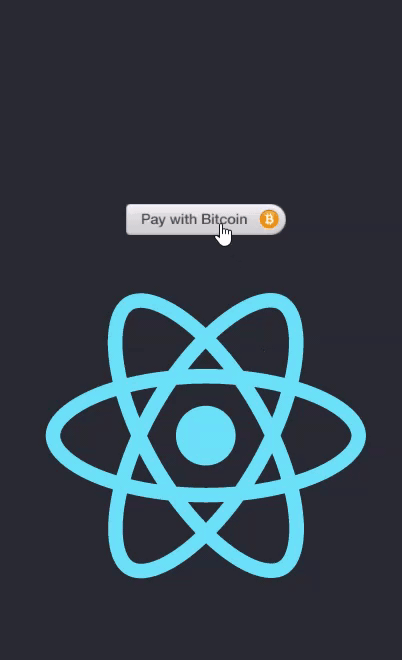

# react-bitcoin-payment-button
Receive Bitcoin Payments on your React website through the [Blockonomics](https://www.blockonomics.co/) Payment Button.


### Installation

`npm i react-bitcoin-payment-button`

### Demo



### Usage

To use the Blockonomics Payment Button you first need to generate a UID. To generate an UID follow this [guide](https://www.youtube.com/watch?v=aRdcKrMcqSA&t=0s).

Example:
```
import React from 'react';
import { BitcoinPaymentButton } from 'react-bitcoin-payment-button';

export default function App() {
  return (
    <div className="App">
        <BitcoinPaymentButton uid="Enter Your Own UID generated by Blockonomics Here"/>
    </div>
  );
}
```

### Customization


The customized example above was accomplished by passing the following props to BitcoinPaymentButton:
```
import React from 'react';
import { BitcoinPaymentButton } from 'react-bitcoin-payment-button';

export default function App() {
  return (
    <div className="App">
        <BitcoinPaymentButton 
        uid="Enter Your Own UID generated by Blockonomics Here"
        imageURL="https://cdn.iconscout.com/icon/free/png-512/bitcoin-390-920575.png"
        font="Roboto, Helvetica, Arial, sans-serif"
        backgroundColor="#131a22"
        descriptionColor="#fff"
        titleColor="#fff"
        buttonColor="#428bca"
        hoverColor="#254563" 
        hideBlockonomics="true"
        inputHeights="44px"
        progressbarColor="#428bca" 
        BTCAmountColor="#428bca"        
        />
    </div>
  );
}
```
